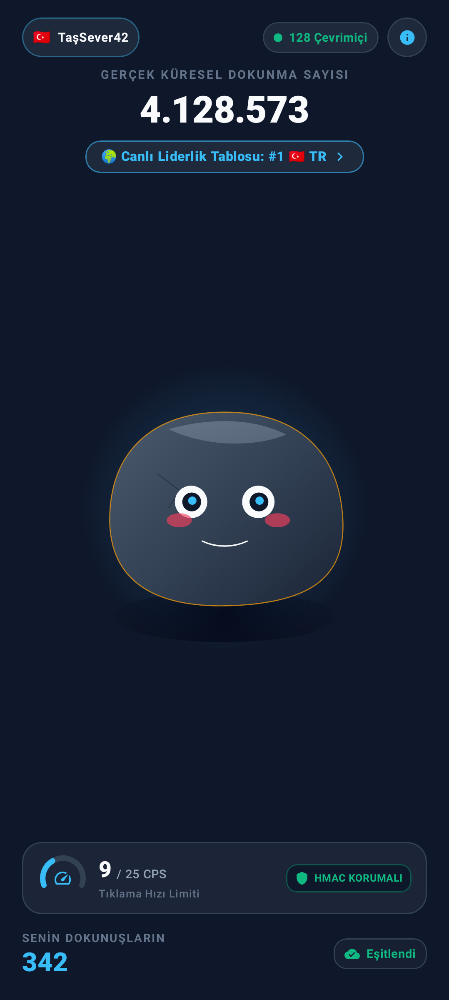
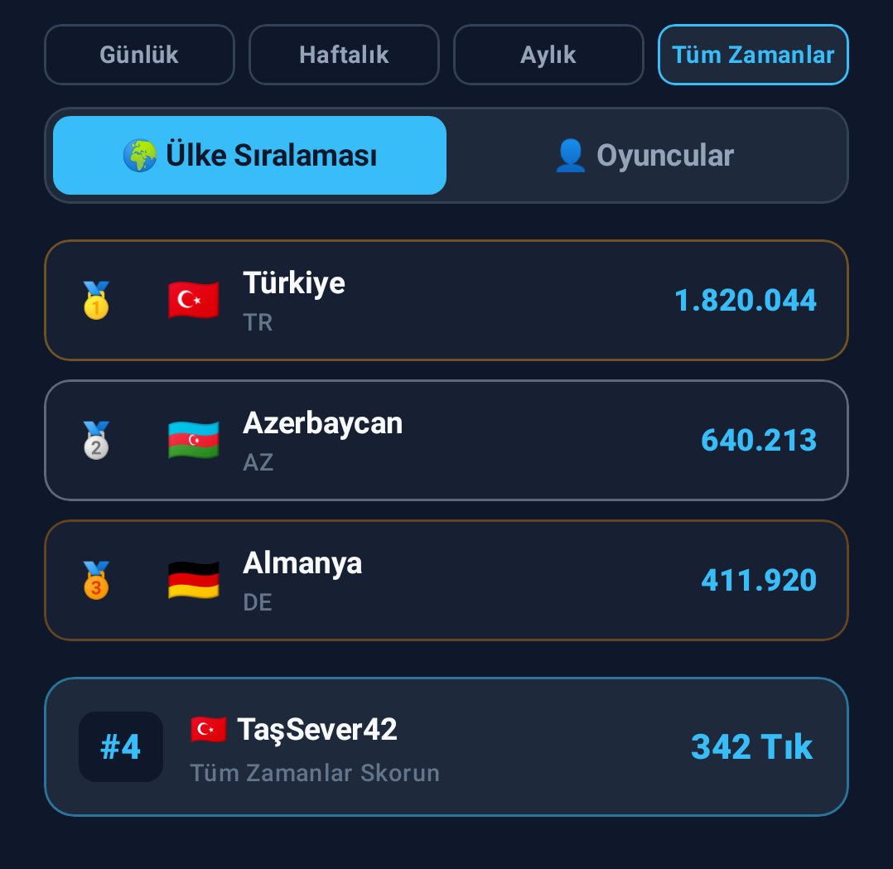
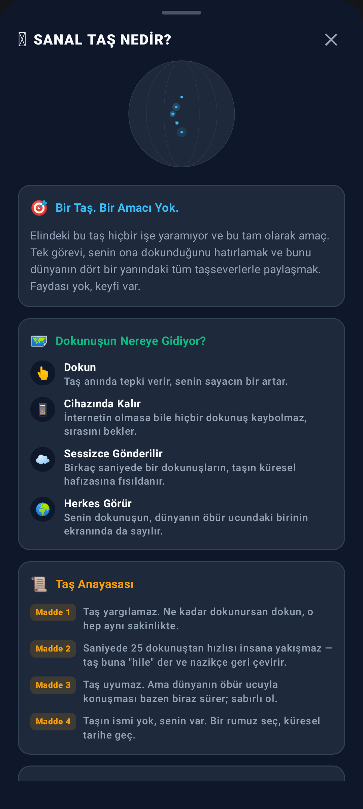

# 🪨 Sanal Taş

> Bir taş. Bir amacı yok. Ve bu tam olarak amacı.

**Sanal Taş**, 1975'in efsanevi "Pet Rock" çılgınlığından ilham alan, tamamen anlamsız ama bir o kadar keyifli bir küresel dokunma oyunu. Elindeki taşa dokun, sayaç bir artsın — ve dokunuşun, dünyanın öbür ucundaki birinin ekranında da sayılan tek bir küresel sayaca eklensin.

Hiçbir görevi yok, hiçbir seviyesi yok, kazanmanın bir yolu yok. Tek şey var: dokunmak.

## Ekran Görüntüleri

  
  &nbsp;&nbsp;
  
  &nbsp;&nbsp;
  

## Nasıl Oynanır?

1. **Dokun** — Taşa her dokunuşunda sayacın bir artar, taş anında tepki verir.
2. **Cihazında Kalır** — İnternetin olmasa bile hiçbir dokunuş kaybolmaz, sırasını bekler.
3. **Sessizce Gönderilir** — Birkaç saniyede bir dokunuşların, taşın küresel hafızasına fısıldanır.
4. **Herkes Görür** — Senin dokunuşun, dünyanın öbür ucundaki birinin ekranında da sayılır.

Taş, ne kadar dokunursan dokun aynı sakinliğini korur — ama ruh haliyle tepki verir:

| Hız | Ruh Hali |
|---|---|
| Yavaş | 😌 Sakin |
| Orta | 🙂 Mutlu |
| Hızlı | ⚡ Enerjik |
| Çok Hızlı | 🔥 Hiperaktif |

Saniyede 25 dokunuştan hızlısı insana yakışmaz — taş buna "hile" der ve nazikçe geri çevirir.

## Özellikler

- 🌍 **Gerçek Zamanlı Küresel Sayaç** — Dünyanın her yerinden gelen dokunuşlar tek bir sayaçta birleşir.
- 🏆 **Liderlik Tablosu** — Günlük, Haftalık, Aylık ve Tüm Zamanlar sıralamaları; hem oyuncu hem ülke bazında.
- 👥 **Çevrimiçi Oyuncu Sayacı** — O an oyunu açık tutan gerçek kişi sayısını gösterir.
- 🛡️ **Hile Koruması** — Saniyede 25 dokunuş üst sınırı ile herkes için adil bir yarış.
- 📴 **Çevrimdışı Öncelikli** — İnternet yokken bile dokunuşların kaybolmaz, bağlantı gelince otomatik senkronize olur.
- 🏳️ **Ülke Rozeti** — Kayıt olurken seçtiğin ülke bayrağı, liderlik tablosunda seninle birlikte görünür.
- 🔄 **Ekran Kilidi** — Oyun her zaman dik (portrait) modda kalır, telefon çevrilse de dönmez.

## Peki Neden?

1975'te insanlar gerçek bir taşı "evcil hayvan" diye sattı, dünya bayıldı. Biz bir adım öteye gittik: taşı dijitalleştirdik ve herkesin birlikte dokunabileceği bir hale getirdik. Dağları taşıyamadık ama en azından bir taşa birlikte dokunabiliyoruz.

Hiçbir anlamı yok — tam da bu yüzden bu kadar güzel.
